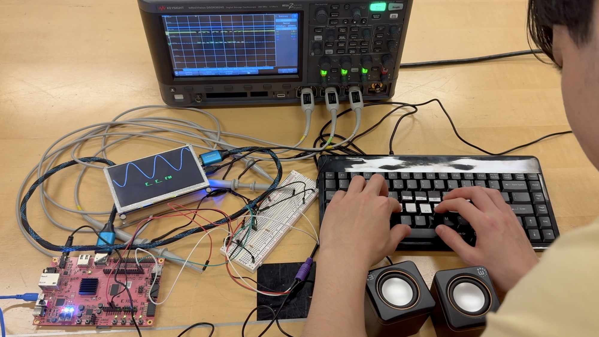

# FPGA Piano

Demo video: [youtu.be/B2POsO4RqfI](https://youtu.be/B2POsO4RqfI)

Made an FPGA read in raw signals coming from a PS/2 keyboard so you can play it like a piano. Also programmed FPGA to write to HDMI monitor to display the sinusoidal waveform of the audio being played and show text of the notes being played.

Design verilog is in the `design/` folder.

Testbenches for simulation are included in the `sim/` folder.

Block, state, and timing diagrams are in the `diagrams/` folder.

